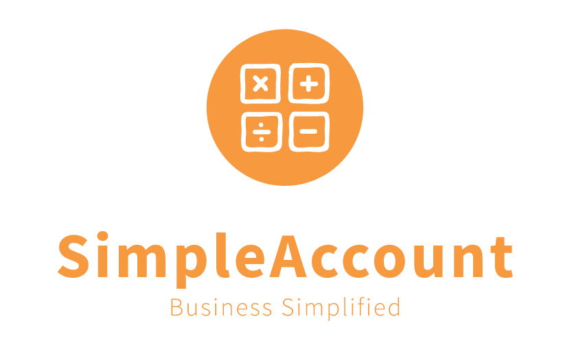

# SimpleAccount

## Accounting and inventory management software

SimpleAccount is an account and inventory management software. Current features include inventory, accounting and invoicing functionalities. Many features are planned and currently in conceptualization.

## SimpleAccount is a free software

SimpleAccount is a free software under the GNU GPL V3 terms. Everybody is free to contribute and make use of this software.

Make your business simplified!

### Features

- [x] Product parameters (type, tax, manufacturer)
- [x] Manage products
- [x] Manage customers
- [x] Manage vendors
- [x] Purchases (add/edit)
- [x] Sales (add/edit)
- [x] Receipts
- [x] Vouchers
- [x] Credits
- [x] Debits
- [x] Invoicing (Sale/Credits/Debits/Receipts/Vouchers) with template support
- [x] Bank accounts and transactions
- [x] Income and Expense

### Features in progress
- [ ] User roles
- [ ] Reporting
- [ ] Dashboard
- [ ] Global search

### Features planned
Not in a particular order though!
- [ ] Intelligence (! AI/MachineLearning whatever is called !)
- [ ] Automatic purchase orders
- [ ] Shop frontend and customer orders
- [ ] Intelligent notifications
- [ ] i18n
- [ ] Product QR code scanning support (For automatic entry into purchase/sale)
- [ ] Many more!!!

## Requirements
- PHP 7.3
- MySql/Postgress

## Installation
SimpleAccount is built on Laravel. Standard Laravel deployment will do the work.

1. Download the source code
2. `composer install`
3. `npm install && npm run dev`
4. `php artisan migrate`
5. `php artisan storage:link`
6. `php artisan serve`
7. Access application on http://localhost:8000

## Support
You could either chose to open a ticket here or mail your queries to **"support at simpleaccount dot app"**

## Vulnerability Disclosure
Please contact at **"support at simpleaccount dot app"**. Security issues will be promptly addressed.

## Support Development
This application free software. Lot of effort has been put into developing it. You could please consider making contributions at [PayPal](https://paypal.me/adarshahd)

💜 **Thank you for your support!** 💜

### Credits
* Laravel Framework
* Laravel Snappy
* Spatie
* Laravel Blueprint
* Many other free and open source software!
